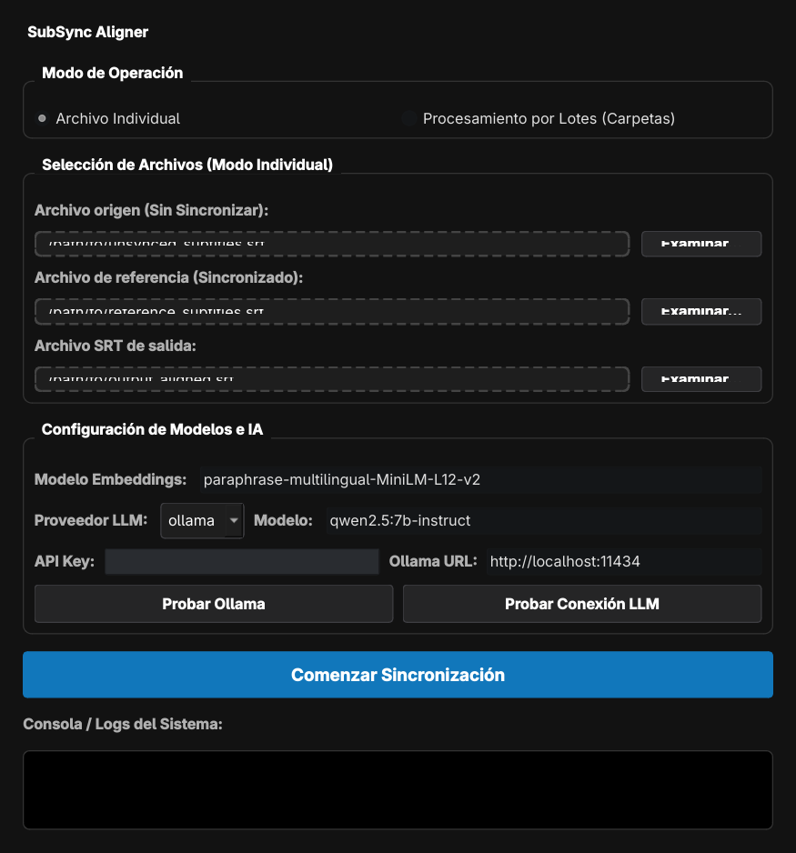

# 🎬 CrossSync - Semantic Subtitle Synchronizer

CrossSync is a tool designed to synchronize out-of-sync subtitles (e.g., in Spanish) using a correctly synchronized reference subtitle in another language (e.g., English). It utilizes multilingual sentence embeddings to calculate semantic alignment across different languages and optional LLMs (Ollama/Gemini) to handle complex splits.

<p align="center">
  
</p>

## 🚀 Features

* **Graphical & Command-Line Interfaces**: Run the application with no arguments to launch the custom dark-theme GUI, or use command-line parameters for script integrations.
* **Integrated API & Connection Testers**: Configure and test local Ollama endpoints or remote Gemini/OpenAI API credentials directly within the interface before running a job.
* **Standalone Desktop Executable**: Compiles into self-contained portable folders for Linux and Windows using a single build script.
* **Multilingual Semantic Alignment**: Uses `SentenceTransformers` (`paraphrase-multilingual-MiniLM-L12-v2`) to align subtitle text semantically, regardless of the language.
* **Dynamic Time Warping (DTW)**: Sequentially aligns the source and target subtitle blocks.
* **Semantic Dominant Match**: Automatically detects when a dialogue line matches a single target slot among a group containing unrelated elements (like on-screen text, signs, timestamps, or songs), leaving the extra elements empty.
* **LLM-assisted Splits**: Optionally utilizes LLM models (e.g., local `qwen2.5:3b` via Ollama, or remote `gemini-2.5-flash` via Google AI Studio) to semantically divide sentences when a single subtitle block must be split into multiple reference timestamps.
* **Vocabulary Validation**: Employs an accent-insensitive validation helper to guarantee that only words present in the original subtitle are included in the final output, preventing translation leakage or hallucinations.
* **Google Colab Notebook**: Includes an interactive notebook (`CrossSync_Colab.ipynb`) with visual form fields and automated GPU-accelerated Ollama installation.

## 🛠️ Installation

1. Clone the repository:
   ```bash
   git clone https://github.com/HichamLL04/CrossSync.git
   cd CrossSync
   ```

2. Create and activate a virtual environment:
   ```bash
   python -m venv .venv
   source .venv/bin/activate  # On Windows: .venv\Scripts\activate
   ```

3. Install the dependencies:
   ```bash
   pip install -r requirements.txt
   ```

## ⚙️ Usage

### Graphical User Interface (GUI)
Simply run the sync script without arguments (or with the `--gui` flag) to launch the custom graphical interface:
```bash
python sync.py
```
*You can drag and drop your `.srt` files or folder paths directly onto the GUI input fields, configure LLM endpoints, and test your connection before running the synchronizer.*

### Basic Sychronization (Embeddings only)
To synchronize subtitles using only semantic embedding alignment (falls back to proportional split for multi-line divisions):
```bash
PYTHONPATH=. python sync.py \
  --unsynced "/path/to/unsynced.srt" \
  --synced "/path/to/reference.srt" \
  --output "/path/to/output.srt"
```

### Advanced Synchronization (With Ollama LLM)
Ensure you have [Ollama](https://ollama.com/) running and the chosen model pulled (e.g., `ollama pull qwen2.5:3b`):
```bash
PYTHONPATH=. python sync.py \
  --unsynced "/path/to/unsynced.srt" \
  --synced "/path/to/reference.srt" \
  --output "/path/to/output.srt" \
  --llm-provider ollama \
  --llm-model qwen2.5:3b
```

### Advanced Synchronization (With Gemini API)
```bash
PYTHONPATH=. python sync.py \
  --unsynced "/path/to/unsynced.srt" \
  --synced "/path/to/reference.srt" \
  --output "/path/to/output.srt" \
  --llm-provider gemini \
  --llm-model gemini-2.5-flash \
  --api-key "YOUR_GEMINI_API_KEY"
```

### Command Line Arguments
* `--unsynced`: Path to the out-of-sync subtitle file.
* `--synced`: Path to the reference subtitle file (correctly timed).
* `--output`: Path where the synchronized subtitle file will be saved.
* `--llm-provider`: LLM provider to use (`ollama`, `gemini`, or `none`).
* `--llm-model`: The name of the model to use (e.g., `qwen2.5:3b`, `gemini-2.5-flash`).
* `--ollama-url`: The Ollama API URL (default: `http://localhost:11434`).
* `--api-key`: Clave API (for Gemini/OpenAI).

## 📦 Building Standalone Executable
You can package CrossSync into a native, standalone executable directory (Linux or Windows) using the wrapper script:
```bash
python build.py
```
This command automatically installs packaging dependencies (PyInstaller/PyQt6) and compiles the codebase into `dist/SubSync/`. To run it, run the `SubSync` binary inside that folder.

## 📓 Google Colab
You can run CrossSync in the cloud using the included notebook:
1. Open Google Colab.
2. Upload `CrossSync_Colab.ipynb` to your Google Drive or open it directly.
3. Under *Runtime* > *Change runtime type*, select **T4 GPU** for faster processing.
4. Fill in the visual forms to run the synchronization.
